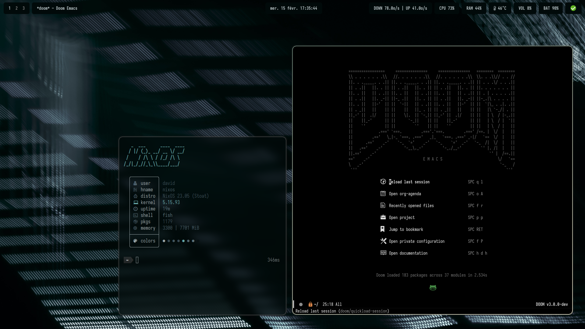

# nixos-config

[](https://nixos.org)



| Type           | Program                                  |
|----------------|------------------------------------------|
| **Shell:**     | fish, zsh                                |
| **DM:**        | tty1                                     |
| **WM:**        | niri, hyprland, sway, gnome              |
| **Bar:**       | waybar                                   |
| **Editor:**    | helix / doom-emacs / neovim / kakoune    |
| **Terminal:**  | ghostty / kitty                          |
| **Launcher:**  | tofi                                     |
| **Browser:**   | firefox / qutebrowser / zen              |
| **Theme:**     | stylix                                   |

## Notable Features

- Support for multiple desktop environments ([`hyprland`](./apps/hyprland/), [`gnome`](./apps/gnome/), [`sway`](./apps/sway/), [`niri`](./apps/niri/))
- [Extensive `niri` configuration](./apps/niri/)
  - Window rules, monitor rules, etc.
- [Extensive `hyprland` configuration](./apps/hyprland/)
  - Scratchpads, window rules, monitor rules, etc.
  - Touchscreen support with gestures, rotation and on-screen keyboard
- [Extensive `gnome` configuration](./apps/gnome/)
  - Configuration via dconf
  - Pre-installed extensions
- [Automatic styling with `stylix`](./apps/stylix/)
- [Extensive `firefox` configuration](./apps/firefox/firefox.nix)
  - `about:config` settings
  - Pre-installed add-ons
  - Declarative containers
- [Declarative partitioning with `disko`](./modules/disko/encrypted-btrfs-impermanence.nix)
- [Ephemeral file system with `impermanence` on btrfs subvolumes](./modules/impermanence/)
- Configuration for common hardware with `nixos-hardware`
- Automatic microcode updates for AMD CPUs with `ucodenix`
- Automatic development shells with `direnv` and `shell.nix`
- My own custom packages including [`autoscreen`](./apps/autoscreen/) (tool to take screenshots randomly each hour) and [`mpdscrobble`](./apps/mpdscrobble/) (utility to send MPD listening history to Last.fm)
- [`mpv` configuration with plugins](./apps/mpv/mpv.nix)
- [`nnn` configuration with plugins and bookmarks](./apps/nnn/nnn.nix)
- [Extensive `qutebrowser` configuration with search engines](./apps/qutebrowser/qutebrowser.nix)
- Support for [fingerprint scanner](./modules/common/fingerprint-scanner.nix), printers, bluetooth, [xbox gamepad](./modules/common/xbox.nix)
- Some [common overlays that fix currently broken packages](./modules/overlays.nix) 
- `flatpak` with automatic packages installation

## Hosts

- **p14s**: Lenovo ThinkPad P14s Gen 4 (AMD Ryzen 7 7840U, 16GB RAM, niri, impermanence)
- **vaio**: Sony Vaio Pro PK13 (Intel Core i5-1035G1, 16GB RAM, niri)
- **x13**: Lenovo ThinkPad X13 Gen 1 (AMD Ryzen 5 4650U, 16GB RAM, niri, impermanence)
- **x1yoga**: Lenovo ThinkPad X1 Yoga Gen 5 (Intel Core i5-10210U, 8GB RAM, hyprland + touch gestures w/ hyprgrass, impermanence)
- **sg13**: Silverstone SG13 (AMD Ryzen 5 2600, RX 580 8GB, 16GB RAM, gnome)
- **x61s**: Lenovo Thinkpad X61s (Intel Core 2 Duo L7500, 3GB RAM, sway)
- **latitude**: Dell Latitude 7420 (Intel Core i7 1165G7, 16GB RAM, hyprland)

## Common Usage

Rebuild the system

```
sudo nixos-rebuild switch --flake .#{host}
sudo nixos-rebuild switch --flake .#{host} --target-host root@<ip address> # for a remote host
```

Delete unused packages

```
sudo nix-collect-garbage -d # for system packages
nix-collect-garbage -d # for home-manager packages
```

Optimise store

```
nix-store --optimise -v
```

### just

A `justfile` is provided, see https://github.com/casey/just for more information.

```
just switch
just clean
```

To generate a bootable image for a host with `nixos-generators`:

```
just generate-image HOST install-iso
```

For the recipes to work properly, create a `.env` and fill it with the needed environment variables:

```
HOST=x13
```

## Install

On a new install, you should first copy `/etc/nixos/hardware-configuration.nix` over `hosts/{host}/hardware-configuration.nix`.

Then add a new definition of the host in `hosts/default.nix` with the wanted profiles.

Installation without impermanence/disko can be done normally from the NixOS Live ISO, then just clone this repo and `just switch` (cf. above).

### Impermanence/disko

When using the impermanence/disko module, the installation changes quite a bit and can even be done from a separate host by plugging the destination storage device.

Installation can be done from any computer running nix, using a live ISO running from a USB key is not recommended as it will most likely run out of space during the install.
The target disk can be any mounted disk (except the one the system is currently running on!) and will then have to be installed on the host computer after the installation is complete.
:

```
# On a new host don't forget to generate the hardware-configuration.nix file and copy it on hosts/{host}/hardware-configuration.nix
# You can do that from a live ISO and then copy it to your build host
nixos-generate-config --no-filesystems

# disko + impermanence install on an existing host called "x1yoga"
sudo nix run 'github:nix-community/disko/latest#disko-install' -- --flake .#x1yoga --disk main /dev/sda --show-trace
# Using just
just first-install-disko x1yoga /dev/sda

# Post-installation - mount the newly installed system on /mnt/root
lsblk # identify luks encrypted partition
sudo cryptsetup open /dev/sda2 luks-1
sudo mount -o subvol=root /dev/mapper/luks-1 /mnt/root
sudo mount -o subvol=persistent /dev/mapper/luks-1 /mnt/root/persistent  
sudo mount -o subvol=nix /dev/mapper/luks-1 /mnt/root/nix
sudo mount /dev/sda1 /mnt/root/boot

# Create password file - MANDATORY as password are not mutable in the impermanence/disko module
mkpasswd > temp_passwd_file
sudo mv temp_passwd_file /mnt/root/persistent/passwd_$USER
sudo chown root:root /mnt/root/persistent/passwd_$USER

# Optional: chroot into the new system to apply other changes
sudo nixos-enter --root /mnt
```

## Post-install

For doom-emacs:

```
git clone --depth 1 https://github.com/doomemacs/doomemacs ~/.config/emacs
~/.config/emacs/bin/doom install
```

## TODO

Some tools and utilities to test

- sops-nix
- git-hooks
- nh
