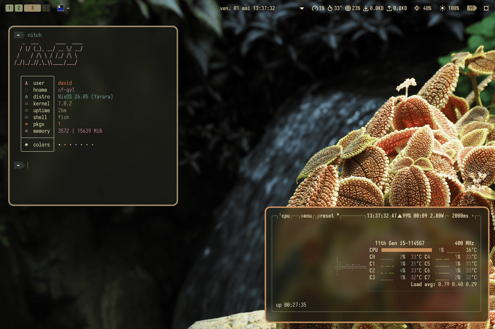
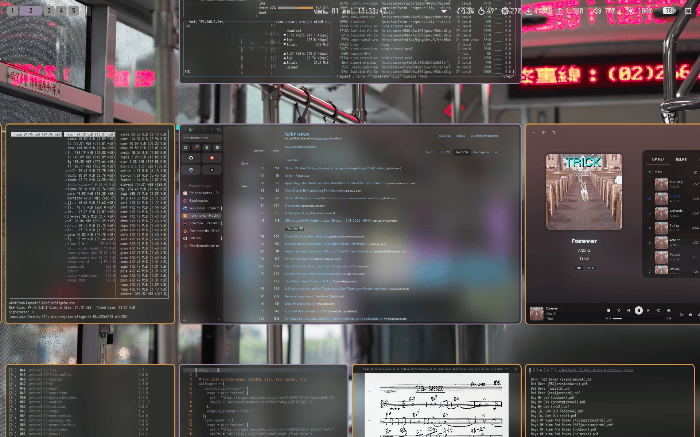
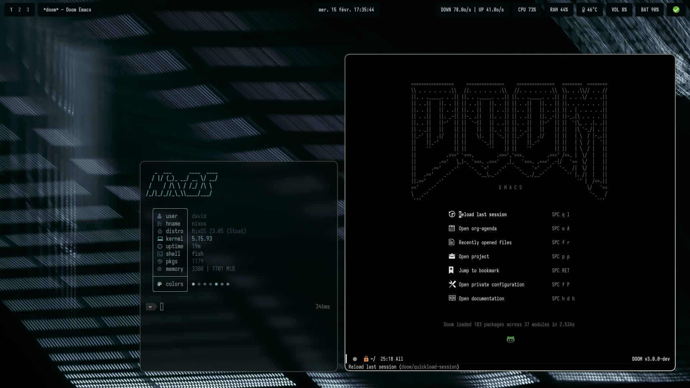

# nixos-config

[](https://nixos.org)







| Type           | Program                                          |
|----------------|--------------------------------------------------|
| **Shell:**     | fish                                             |
| **DM:**        | tty1                                             |
| **WM:**        | niri / sway / gnome                              |
| **Bar:**       | noctalia / waybar                                |
| **Editor:**    | helix / doom-emacs / neovim / kakoune            |
| **Terminal:**  | kitty / ghostty                                  |
| **Launcher:**  | tofi                                             |
| **Browser:**   | zen / firefox / qutebrowser / ungoogled-chromium |
| **Theme:**     | stylix                                           |

## Notable Features

- Support for multiple desktop environments ([`niri`](./apps/niri/), [`gnome`](./apps/gnome/), [`sway`](./apps/sway/))
  - Support for multiple bars with [`waybar`](./apps/waybar) and [`noctalia`](./apps/noctalia)
  - [Extensive `niri` configuration](./apps/niri/)
    - Window rules, monitor rules
    - Left handed input devices
    - Transparency with blur
    - Overview with unified background
  - [Extensive `gnome` configuration](./apps/gnome/)
    - Configuration via dconf
    - Pre-installed extensions
- [Automatic styling with `stylix`](./apps/stylix/)
- Declarative web browsers configuration
  - [Extensive `zen-browser` configuration](./apps/zen-browser/zen-browser.nix)
    - `about:config` settings
    - Pre-installed add-ons, Declarative containers
    - Transparent websites with `transparent-zen` add-on
  - [Extensive `firefox` configuration](./apps/firefox/firefox.nix)
  - [Extensive `qutebrowser` configuration with search engines](./apps/qutebrowser/qutebrowser.nix)
- [Declarative partitioning with `disko`](./modules/disko/encrypted-btrfs-impermanence.nix)
- [Ephemeral file system with `impermanence` on btrfs subvolumes](./modules/impermanence/)
- Secrets management with `sops-nix`
- Configuration for common hardware with `nixos-hardware`
- AI code agent ecosystem (`opencode` with [rtk plugin](./apps/opencode/opencode.nix), [`openskills`](./apps/openskills/), [`hermes-server`](./apps/hermes-server/))
- Declarative [nixflix stack](./apps/nixflix/) cf. [nixflix](https://github.com/kiriwalawren/nixflix)
- Self-hosted tools to be deployed on servers ([`navidrome`](./apps/navidrome/), [`immich`](./apps/immich), [`nextcloud`](./apps/nextcloud), etc. cf. proxmox hosts definitions)
- Automatic development shells with `direnv` and `shell.nix`
- My own custom packages including [`autoscreen`](./apps/autoscreen/) (tool to take screenshots randomly each hour), [`mpdscrobble`](./apps/mpdscrobble/) (utility to send MPD listening history to Last.fm) and [`symmetri`](./apps/symmetri/) (custom system metrics collection service)
- [`mpv` configuration with plugins](./apps/mpv/mpv.nix)
- [`steam`](./apps/steam/) with Proton-GE and MangoHud performance overlay
- Backup scripts with [`rclone` and `restic`](./apps/restic/)
- Support for [fingerprint scanner](./modules/common/fingerprint-scanner.nix), printers, bluetooth, [xbox gamepad](./modules/common/xbox.nix)

## Hosts

- **p14sg6**: Lenovo ThinkPad P14s Gen 6 (AMD Ryzen AI 7 350, 32GB RAM, niri, impermanence)
- **cf-qv1**: Panasonic Let's Note CF-QV1 (Intel Core i5-1145G7, 16GB RAM, niri, impermanence)
- **sg13**: Silverstone SG13 (AMD Ryzen 9 5950X, RTX 3070, 32GB RAM, gnome)
- **x1yoga**: Lenovo ThinkPad X1 Yoga Gen 5 (Intel Core i5-10210U, 8GB RAM, gnome, impermanence)

<details>

<summary><b>Deprecated hosts</b></summary>

- **latitude** (deprecated): Dell Latitude 7420 (Intel Core i7-1165G7, 16GB RAM, niri)
- **p14s** (deprecated): Lenovo ThinkPad P14s Gen 4 (AMD Ryzen 7 7840U, 16GB RAM, niri, impermanence)
- **vaio** (deprecated): Sony Vaio Pro PK13 (Intel Core i5-1035G1, 16GB RAM, niri)
- **x13** (deprecated): Lenovo ThinkPad X13 Gen 1 (AMD Ryzen 5 4650U, 16GB RAM, niri, impermanence)
- **cf-rz6** (deprecated): Panasonic Let's Note CF-RZ6 (Intel Core i5-7Y57, 8GB RAM, niri, impermanence)
- **x61s** (deprecated): Lenovo Thinkpad X61s (Intel Core 2 Duo L7500, 3GB RAM, sway)

</details>

### Proxmox Kimsufi VMs (Dedicated Server)
- **nixos-kimsufi-qbittorrent**: qbittorrent
- **nixos-kimsufi-tor**: non-exit Tor relay

### Proxmox Era VMs (Home Server)
- **nixos-era-hermes**: hermes with hermes-webui
- **nixos-era-nixflix**: nixflix
- **nixos-era-adguard**: adguard-home
- **nixos-era-nextcloud**: nextcloud
- **nixos-era-immich**: immich
- **nixos-era-navidrome**: navidrome server + music tools (slskd, covertone, maloja)
- **nixos-era-homelab**: generic host for other self-hosted tools (paperless, jellyfin, trek, karakeep, etc.)

## Common Usage

### Rebuilding the System

Rebuild the system

```
sudo nixos-rebuild switch --flake .#{host}
sudo nixos-rebuild switch --flake .#{host} --target-host root@<ip address> # for a remote host
```

Delete unused packages

```
sudo nix-collect-garbage -d # for system packages
nix-collect-garbage -d # for home-manager packages
```

Optimise store

```
nix-store --optimise -v
```

### just

On first installation you may need to load the dependencies in your shell for the just recipes to work

```bash
nix-shell -p just nh
```

For the recipes to work properly, create a `.env` file and fill it with the needed environment variables:

```
HOST=x13
```

```
just switch
just clean
# to check all available recipes
just
```

### Maintenance Tools

Additional just recipes are available for maintenance tasks:

```bash
just clean         # Clean old nix generations
just optimize      # Optimize nix store
just flake-linter  # Run flake linter to check for potential duplicate flake inputs
just nix-olde      # Generate outdated packages report with the help of nix-olde (YYYY-MM-DD_nix-olde-report.txt)
```

## Manual Install

On a new install, add a host definition in `hosts/default.nix` with the wanted profiles, then follow the path that matches your setup.

### Impermanence/disko hosts

Install from another running NixOS host (your desktop, a server) with the target disk plugged in. The disk can be any device that isn't the one the build host is running on. Once installed, move the disk to the target machine.

```bash
# Generate hardware-configuration.nix (from a live ISO or the target machine)
# and copy it to hosts/{host}/hardware-configuration.nix
nixos-generate-config --no-filesystems

# disko + impermanence install for host "x1yoga" to /dev/sda
just first-install-disko x1yoga /dev/sda

# Post-install: mount the new system and create the password file (MANDATORY for impermanence)
just post-install-disko x1yoga /dev/sda

# Optional: chroot into the new system
sudo nixos-enter --root /mnt/root
```

### Standard hosts

Install a minimal NixOS from the official ISO, then replace it with your flake config after first boot. This avoids building the full closure in the ISO's RAM-backed store.

```bash
# From the official NixOS minimal ISO: partition, mount, and install the generated minimal config
nixos-generate-config --root /mnt
sudo nixos-install
# Reboot, log in as root, then:
nix-shell -p just nh git
git clone <this-repo> ~/nixos-config && cd ~/nixos-config
cp /etc/nixos/hardware-configuration.nix hosts/<hostname>/
echo "HOST=<hostname>" > .env
just switch
```

### Proxmox VM Images

Dedicated just recipes exist in order to facilitate installation and deployment of remote images.

- Create a VM in Proxmox
- Boot the NixOS minimal ISO
- Set up SSH connection by setting a password for the `nixos` user on the ISO, or by adding your SSH key

```bash
just install-proxmox-vm HOSTNAME IP
# You might need to delete entries in ~/.ssh/known_hosts to connect via SSH
just boot-proxmox-vm HOSTNAME IP
# After first boot, log in as david (initial password: nixos) and change it:
#   passwd
```
